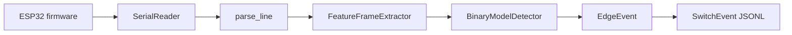
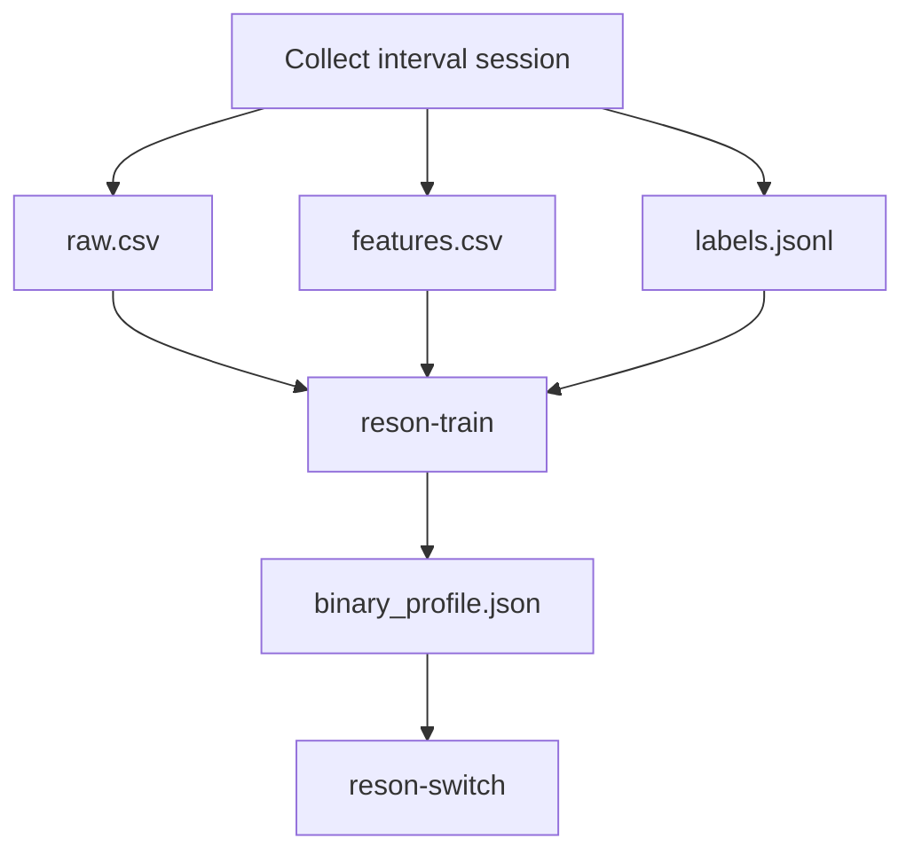

# Reson Architecture

Reson is currently a binary switch pipeline. It reads `t raw env` samples from an ESP32, extracts timestamp-based features, applies a trained binary model, and emits switch `down` / `up` events for downstream consumers such as `/Users/jeraldyuan/dev/eye-cursor`.

## Product Boundary

```text
ESP32 serial stream
  -> parse sample lines
  -> extract feature frames
  -> run trained binary detector
  -> emit switch events
```

Reson does not own pointer control, eye tracking, UI automation, or click injection. Those belong in the downstream consumer.

## Runtime Flow



Key files:

| Layer | File | Responsibility |
| --- | --- | --- |
| Firmware | `firmware/` | ESP32 ADC sampling and `t raw env` serial output |
| Serial | `src/reson/serial_io.py` | Open/read/reconnect/close serial ports |
| Parsing | `src/reson/parser.py` | Parse serial text into `EmgSample` |
| Features | `src/reson/features.py` | High-pass/notch/low-pass path and frame features |
| Model runtime | `src/reson/binary_model.py` | Threshold/logreg/optional torch binary detector |
| Switch conversion | `src/reson/switch.py` | Convert edge events to JSON-safe switch events |
| Recording schema | `src/reson/recording.py` | Shared session file fields, metadata, JSONL helpers |
| Training | `src/reson/training.py` | Load interval sessions and fit binary profiles |

## Applications

| Command | File | Purpose |
| --- | --- | --- |
| `reson-debug` | `src/reson/apps/debug_monitor.py` | Qt monitor, live feature plots, optional model overlay, visual interval recording |
| `reson-record` | `src/reson/apps/record_app.py` | Terminal interval recorder |
| `reson-train` | `src/reson/apps/train_app.py` | Train one model or all supported model families |
| `reson-study` | `src/reson/apps/study_app.py` | Run feature/model/data-scale sweeps |
| `reson-switch` | `src/reson/apps/switch_app.py` | Emit trained switch events as JSONL |

## Data And Model Loop



The preferred label unit is an interval, not a point click marker. A label interval has explicit `label_start` and `label_end` records. Training labels frames inside intervals as active and frames outside intervals as rest, with a configurable ignore margin around interval boundaries.

## Model Families

Reson currently supports:

| Model | Dependency | Use |
| --- | --- | --- |
| `threshold` | standard install | Sanity baseline, usually waveform-length only |
| `logreg` | standard install | Fast interpretable binary classifier |
| `cnn` | `.[ml]` | Optional sequence model |
| `tcn` | `.[ml]` | Optional sequence model |
| `transformer` | `.[ml]` | Optional sequence model |

The current research hypothesis is that waveform length may carry most of the useful single-channel signal. The scaling-study path exists to test that against larger sequence models rather than assume it.

## Event Contract

The external switch contract is intentionally small:

```json
{"type":"switch","phase":"down","t_ms":12345,"duration_ms":0,"source_state":"active"}
{"type":"switch","phase":"up","t_ms":12580,"duration_ms":235,"source_state":"active"}
```

Internal `EdgeEvent` records are converted to `SwitchEvent` records before output. Downstream consumers should depend on switch events, not model internals.

## Review Notes

- `env` from firmware is debug-only. Current detector decisions are based on raw-derived Python features.
- AD8232 is ECG-grade hardware and is not an ideal EMG front end. Treat current results as prototype evidence, not final hardware validation.
- The debug monitor is intentionally practical and still broad: it combines UI, recording, plotting, and optional model overlay. The shared recording schema has been extracted, but UI decomposition can continue later.
- `sessions/`, `models/`, and `studies/` are ignored generated artifacts. Expert review should focus on tracked source, firmware, docs, and tests unless sample data is intentionally shared.
