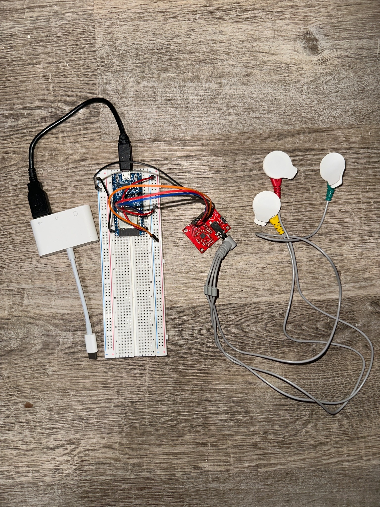

# reson

[](https://github.com/jeraldhu-yuan/reson/actions/workflows/ci.yml)
[](LICENSE)
[](pyproject.toml)
[](https://doi.org/10.5281/zenodo.20631777)

Reson is an early-stage EMG binary switch prototype.

It is not a full HMI stack. Its current product boundary is deliberately narrow:

```text
serial -> parser -> feature frames -> trained binary model -> switch down/up events
```

The intended downstream use is a click layer for an HMI system such as an eye-cursor controller. Reson only tries to answer one question right now: can this hardware and labeling path produce a reliable binary intent signal?

## Demo

A jaw clench detected in real time and turned into a click (prototype, single setup):

[](https://www.youtube.com/watch?v=78xajhyyDSc)

▶ https://www.youtube.com/watch?v=78xajhyyDSc

## Current Status

Reson is technically functional but not validated as a robust control interface.

Implemented:

- ESP32 serial firmware that streams `t raw env` rows.
- Python serial ingestion with reconnect behavior and per-port lockfiles.
- Timestamp-based feature extraction from raw ADC samples.
- Interval-labeled data collection through `reson-debug` and `reson-record`.
- Prompted interval data collection through `reson-debug --prompt` or `reson-prompt-record`, avoiding keyboard labels during signal windows.
- Binary model training for threshold, logistic regression, and optional PyTorch sequence models.
- Public headless switch API for downstream controllers.
- Runtime switch output as JSONL `down` / `up` events.

Tested in repo:

- Parser behavior.
- Serial reconnect behavior using test doubles.
- Port-lock behavior.
- Recording schema helpers.
- Binary model profile loading and switch event lifecycle.
- Training loaders and simple model fitting on synthetic fixture data.

Current evidence:

- The signal path can run end to end on the current ESP32 + AD8232 prototype.
- Waveform length has appeared visually useful in early local recordings.
- Preliminary local training can produce baseline models from interval-labeled sessions.

Not yet validated:

- Session-to-session generalization.
- Day-to-day electrode-placement robustness.
- Robustness against head motion, cable motion, talking, swallowing, and electrode disturbance.
- Performance as an actual click layer for a downstream HMI under realistic use.
- Whether the current AD8232-based hardware is sufficient for reliable EMG switching.

## Hardware

Current prototype:

- ESP32 development board.
- AD8232 ECG front-end board used experimentally for jaw EMG.
- Analog output wired to ESP32 `GPIO34`.
- USB serial connection to the host computer.

Prototype photo:



Current wiring:

| AD8232 pin | ESP32 pin |
| --- | --- |
| `3.3V` | `3V3` |
| `GND` | `GND` |
| `OUTPUT` | `GPIO34` |

Notes:

- `LO+` / `LO-` are not used by current firmware.
- AD8232 is ECG-grade hardware, not an ideal EMG front end.
- This is a non-medical prototype and is not intended for diagnosis or treatment.
- Current hardware should be treated as an evidence-generating prototype, not as final instrumentation.

## Serial Contract

Firmware emits one whitespace-delimited row per sample:

```text
t raw env
```

Fields:

- `t`: ESP32 timestamp in milliseconds.
- `raw`: ESP32 ADC reading.
- `env`: firmware-side debug envelope.

The Python model path uses raw-derived features. `env` is retained for debugging and comparison, not as the source of truth for current model decisions.

Defaults:

- Baud: `230400`
- Target sample rate: approximately `250 Hz`

## Signal And Control Path

At runtime:

1. `SerialReader` reads firmware lines.
2. `parse_line` converts valid rows into `EmgSample` records.
3. `FeatureFrameExtractor` builds timestamp-based frames from raw samples.
4. `BinaryModelDetector` converts feature frames into active/rest state.
5. Edge events are converted into switch JSONL events.

Core source files:

| Layer | File |
| --- | --- |
| Public switch API | `src/reson/api.py` |
| Serial IO | `src/reson/serial_io.py` |
| Parser | `src/reson/parser.py` |
| Feature extraction | `src/reson/features.py` |
| Binary model runtime | `src/reson/binary_model.py` |
| Switch event conversion | `src/reson/switch.py` |
| Training | `src/reson/training.py` |

## Public Switch API

Downstream HMI projects should integrate through `reson.api`, not the demo
clicker UI. The API exposes EMG switch state and lifecycle events only; it does
not own pointer movement, gaze tracking, or mouse injection.

Import API:

```python
from reson import EmgSample, ResonSwitch

switch = ResonSwitch.from_profile("models/clean_wl_threshold_tuned.json")
update = switch.feed(EmgSample(t_ms=0, raw=1000, env=0))

for event in update.events:
    print(event.phase)
```

Each `SwitchUpdate` includes:

- `probability`: current model probability.
- `is_active`: current held/active state.
- `events`: zero or more `SwitchEvent` lifecycle edges.

Call `flush()` when a stream ends so an open press is terminated:

```python
final_update = switch.flush()
```

For process boundaries, use the existing JSONL CLI:

```bash
reson-switch --port /dev/cu.usbserial-XXXX --baud 230400 --profile models/clean_wl_threshold_tuned.json --status
```

`reson-switch` is now a thin wrapper around the same public API.

## Install

From the repository root:

```bash
python3.11 -m venv .venv
source .venv/bin/activate
python -m ensurepip --upgrade
python -m pip install -U pip setuptools wheel
python -m pip install '.[dev]'
```

Supported Python: 3.11 / 3.12. Unsupported: 3.14. If `python3.11` is not on PATH, install Python 3.11/3.12 and use the full path to that interpreter when creating `.venv`.

For optional CNN/TCN/Transformer training:

```bash
python -m pip install -e '.[dev,ml]'
```

The optional sequence models are exploratory. They are not expected to outperform simple baselines without substantially more labeled data.

## Firmware

Firmware is versioned in this repo:

- Arduino sketch: `firmware/esp32_emg_stream/esp32_emg_stream.ino`
- PlatformIO C++ firmware: `firmware/esp32_emg_stream_cpp/`
- Firmware notes: `firmware/README.md`

Recommended PlatformIO path from repo root:

```bash
python -m pip install -r requirements-firmware.txt
make firmware-upload
make firmware-monitor
```

Direct serial check:

```bash
pyserial-miniterm /dev/cu.usbserial-XXXX 230400 --raw
```

If no data appears, press the ESP32 reset button once. Exit miniterm with `Ctrl+]`.

## Collect Data

Data collection is the main current bottleneck. Use interval labels, not point labels.

Preferred visual prompted recording path:

```bash
reson-debug \
  --port /dev/cu.usbserial-XXXX \
  --baud 230400 \
  --record-dir sessions/prompt-gui-001 \
  --prompt \
  --prompt-trials 20 \
  --prompt-press-sec 1.0 \
  --prompt-gap-sec 3.0 \
  --prompt-no-bell
```

The debug monitor shows raw/features while generating `label_start` / `label_end` events automatically from a timed protocol. Start the command, then keep hands off the laptop during the protocol and follow the large GUI phase prompt.

Terminal prompted fallback:

```bash
reson-prompt-record \
  --port /dev/cu.usbserial-XXXX \
  --baud 230400 \
  --out sessions/prompt-001 \
  --trials 20 \
  --press-sec 1.0 \
  --gap-sec 3.0 \
  --status \
  --no-bell
```

Manual visual recording fallback:

```bash
reson-debug \
  --port /dev/cu.usbserial-XXXX \
  --baud 230400 \
  --record-dir sessions/interval-001
```

During recording:

- Hold `Space` or `c` during the intended click/clench interval.
- Release when the intended click/clench ends.
- Close the window to stop.
- Do not use this mode for training data if keyboard/trackpad interaction couples into the ADC signal.

Terminal fallback:

```bash
reson-record \
  --port /dev/cu.usbserial-XXXX \
  --baud 230400 \
  --out sessions/interval-001 \
  --status
```

Terminal mode uses toggle intervals:

- Press `c` once for `label_start`.
- Press `c` again for `label_end`.
- Press `q` to stop.

Each session writes:

- `meta.json`: setup metadata.
- `raw.csv`: host time, ESP32 timestamp, raw ADC, debug env, original line.
- `features.csv`: frame-level features.
- `labels.jsonl`: interval labels, prompt phases, and session boundaries.

See `docs/data_collection_protocol.md` and `docs/data_schema.md` before collecting data for comparison experiments.

## Train Baseline Models

Start with simple baselines. They are included because they are interpretable and often hard to beat with limited single-channel biosignal data.

Waveform-length threshold baseline:

```bash
reson-train \
  --sessions sessions \
  --model threshold \
  --features wl \
  --out models/wl_threshold.json
```

Waveform-length logistic regression:

```bash
reson-train \
  --sessions sessions \
  --model logreg \
  --features wl \
  --epochs 100 \
  --out models/wl_logreg.json
```

Exploratory model sweep:

```bash
reson-study \
  --sessions sessions \
  --models threshold,logreg,cnn,tcn,transformer \
  --features wl,core,all \
  --fractions 0.25,0.5,1.0 \
  --epochs 20,100 \
  --hidden 8,16 \
  --out studies/binary_scaling.csv \
  --allow-skip-optional
```

Interpretation rule: if waveform-length threshold or logistic regression wins, that is useful evidence. It means the current data/hardware may not justify larger models yet.

## Run Switch Output

Run a trained binary profile:

```bash
reson-switch \
  --port /dev/cu.usbserial-XXXX \
  --baud 230400 \
  --profile models/wl_threshold.json \
  --status
```

Output is JSONL:

```json
{"type":"switch","phase":"down","t_ms":12345,"duration_ms":0,"source_state":"active","host_time_s":1776400000.123}
{"type":"switch","phase":"up","t_ms":12580,"duration_ms":235,"source_state":"active","host_time_s":1776400000.358}
```

Event-stream invariant: every `down` is followed by exactly one terminal
event. A press that clears `min_event_ms` ends in `up`; a shorter transient
ends in `cancel` (same fields, `phase":"cancel"`) so consumers never see a
dangling `down`. Treat `cancel` as "no click delivered".

Downstream consumers should depend on this switch-event schema, not on model internals.

## Evaluate (held-out, event-level)

`reson-eval` replays raw samples through the runtime detector and scores the
emitted lifecycle against click-onset and prompt-phase annotations. The primary
scorer uses a frozen `[-200, +200] ms` onset window, counts every unmatched
`down` (including later-cancelled activations), and keeps completed false clicks
as a diagnostic subset. Phase exposure is accepted only inside the finite
first-to-last usable raw-sample span; out-of-recording annotations fail the
evaluation instead of enlarging a rate denominator. A raw gap over 100 ms also
fails continuous-exposure validation rather than being counted as quiet time.

```bash
# Compare model baselines across the prompted sessions:
reson-eval \
  --sessions sessions \
  --include-glob 'prompt-gui-*' \
  --configs threshold:wl,logreg:wl,logreg:all \
  --report studies/eval_summary.csv

# Acceptance-oriented gate selection: two predeclared configs, inner LOSO
# selection, and one score on each untouched outer session:
reson-eval --sessions sessions --include-glob 'prompt-gui-*' \
  --nested-sweep threshold:wl --per-session

# Broad sweeps remain exploratory, not acceptance evidence:
reson-eval --sessions sessions --include-glob 'prompt-gui-*' \
  --sweep threshold:wl --decision-grid full
```

It reports the metrics listed under "What Good Performance Would Mean":
detection rate, missed clicks, false `down` events per minute during rest and
during artifact-only windows, and down/up latency and event-duration error.
`--include-glob`/`--exclude` restrict the session set (directories containing
`bad` are always skipped). `--nested-sweep` defaults to the frozen runtime
default and previously documented tuned gates; `--decision-grid full` opts into
the broader exploratory grid. See `docs/adversarial_evaluation.md` for the
frozen contract and why the former 100%-detection claim was withdrawn.

## Demo Clicker

`reson-clicker` is a small GUI target you can click with your muscle to feel a
trained model out. Each completed press lights the target, beeps, and bumps a
counter.

```bash
# Live, from the ESP32:
reson-clicker --profile models/wl_threshold.json --port /dev/cu.usbserial-XXXX

# Offline, replaying a recorded session (no hardware needed):
reson-clicker --profile models/wl_threshold.json --replay sessions/prompt-gui-001
```

## What Good Performance Would Mean

The current goal is not high benchmark accuracy on a single recording. The useful target is reliable binary control under realistic nuisance conditions.

Minimum useful metrics:

- Every unmatched `down` per minute during rest and artifact-only periods,
  including activations that later end in `cancel`.
- Raw `false_downs_other` and completed false clicks; neither may disappear
  from aggregate ranking.
- Missed intended clicks per minute during guided click sessions.
- Median and tail down latency from intended clench onset.
- Up latency after intended release.
- Nested gate selection with untouched outer sessions, not only random frames
  or gates chosen from aggregate outer-fold results.
- Stability after unplug/replug and app restart.

Stronger claims should wait until there are multiple sessions across placements, days, and artifact conditions.

## Known Limits

- Current hardware is not an EMG-specific front end.
- Current data volume is small and not packaged as a public benchmark.
- Motion artifacts may overlap with intentional jaw activation.
- Electrode placement and cable motion are likely major confounds.
- The debug monitor is practical but still broad: it combines plotting, recording, and optional model overlay.
- Optional neural models are available for experiments, not as evidence of maturity.

## Next Evidence-Generating Step

Collect a small but disciplined dataset before adding more model complexity:

- At least 5-10 sessions.
- Multiple electrode placements or reattachments.
- Rest-only segments.
- Intentional click/clench intervals.
- Artifact-only segments: head movement, cable tug, jaw shift without click, talking/swallowing if relevant.
- Held-out sessions reserved for evaluation.

Then compare waveform-length threshold, waveform-length logistic regression, and sequence models using `reson-study`.

## Reviewer References

- Architecture: `ARCHITECTURE.md`
- Data schema: `docs/data_schema.md`
- Data collection protocol: `docs/data_collection_protocol.md`
- Validation status: `docs/validation_status.md`
- Reviewer guide: `docs/reviewer_guide.md`
- Demo plan: `docs/demo_plan.md`
- Firmware: `firmware/README.md`

## Safe Shutdown / Recovery

- Prefer normal app close (`Ctrl+C` or window close) before unplugging ESP32.
- On unplug/replug, apps auto-retry serial reconnect.
- Only one process may own a serial port at once; Reson uses lockfiles under `.reson_locks/`.

Recovery checklist:

```bash
ls /dev/cu.usbserial* /dev/tty.usbserial* 2>/dev/null
pkill -f "pyserial-miniterm|reson-debug|reson-switch|reson-record"
```

## Tests

```bash
python -m pytest -q
```

## Contributing

See [CONTRIBUTING.md](CONTRIBUTING.md). Bug reports and hardware
reports from real setups are especially welcome at this stage.

## Citation

If you use Reson in research, please cite it via the metadata in
[CITATION.cff](CITATION.cff) (GitHub renders a "Cite this repository"
button from it).

## License

Reson is released under the [MIT License](LICENSE).
